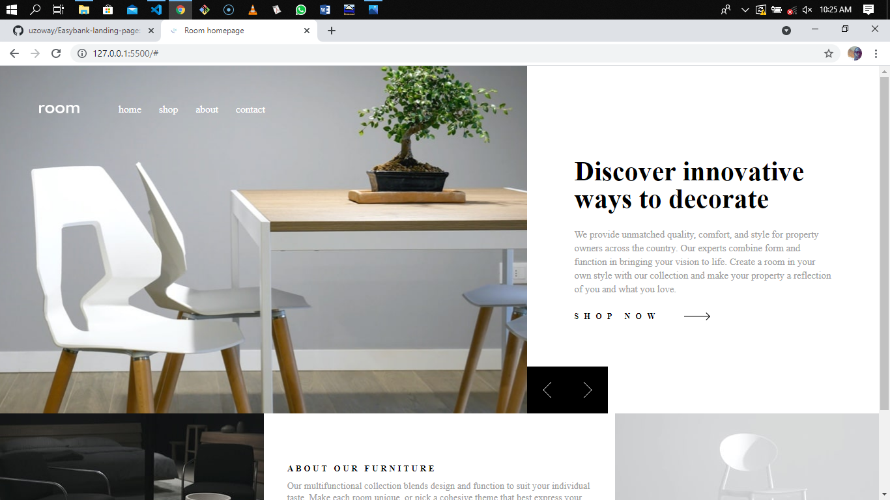

# Room homepage 

This is a solution to the [Room homepage challenge on Frontend Mentor](https://www.frontendmentor.io/challenges/room-homepage-BtdBY_ENq). Frontend Mentor challenges help you improve your coding skills by building realistic projects. 

## Table of contents

- [Overview](#overview)
  - [The challenge](#the-challenge)
  - [Screenshot](#screenshot)
  - [Links](#links)
- [My process](#my-process)
  - [Built with](#built-with)
  - [What I learned](#what-i-learned)
  - [Useful resources](#useful-resources)
- [Author](#author)
- [Acknowledgments](#acknowledgments)

## Overview

### The challenge

Users should be able to:

- View the optimal layout for the site depending on their device's screen size
- See hover states for all interactive elements on the page
- Navigate the slider using either their mouse/trackpad or keyboard
- See a preloader before the site fully loads

### Screenshot



### Links

- [Solution URL](https://your-solution-url.com)
- [Live site URL](https://your-live-site-url.com)

## My process

### Built with

- Semantic HTML5 markup
- CSS
- Flexbox
- Desktop-first workflow
- Vanilla JS

### What I learned

Completing this project has helped me improve my Frontend coding skills and also learn new skills. Some of this new skills include:

- How to add a preloader to a website
- Check for device screen size/viewport before executing a particular code using Javascript

Below is a code snippet of how I successfully added the preloader to the website.

```html
<div class="loader">
    <div id="round" class="round1">
      <span></span>
      <span></span>
    </div>
</div>
```

```css
.loader{
    width: 100%;
    height: 100vh;
    position: fixed;
    top: 0;
    left: 0;
    background: hsl(0, 0%, 100%);
    z-index: 100;
    display: flex;
    align-items: center;
    justify-content: center;
    opacity: 1;
    transition: opacity 2s ease-in;
}

.loader .round1{
    display: block;
    animation: round1-rotate 2.0s infinite linear;
}

.loader .round1 span{
    width: 40px;
    height: 40px;
    background-color: hsl(0, 0%, 0%);
    display: block;
    border-radius: 50%;
    animation: round1-bounce 2.0s infinite ease-in;
}

.loader .round1 span:nth-child(2){
    animation-delay: -1.0s;
}

@keyframes round1-rotate{
    100%{
        transform: rotate(360deg);
    }
}

@keyframes round1-bounce {
    0%, 100%{
        transform: scale(0);
    }
    50%{
        transform: scale(1);
    }
}
```

```js
const loader = document.querySelector(".loader");
const hero = document.querySelector(".hero");
const about = document.querySelector(".about");

function preloader(){
    setTimeout(() => {
        loader.style.opacity = 0;
        loader.style.display = "none";

        setTimeout(() => {
            hero.style.opacity = 1;
            about.style.opacity = 1;
        }, 50);
    }, 3500);
}

preloader();
```

To check for device screen size/viewport before executing a line of code, the code snippet below shows how I was able to achieve that

```js
leftBtn.onclick = function(){
    if(i>0 && document.documentElement.clientWidth < 991){
        gallery.style.backgroundImage = bgImageMobile[i-1];
        header.innerHTML = head[i-1];
        paraGraph.innerHTML = paragraph[i-1];
        i--;
}
```

### Useful resources

- [Adding Preloader](https://www.youtube.com/watch?v=BwhTKJFpKSw&t=78s) - This video fromBrad Traversy youtube channel helped me understand the concept of adding a preloader to a website using HTML, CSS and Js
- [Checking for device screen size using Js](https://responsivedesign.is/develop/javascript/conditionally-load-javascript-based-on-media-query/) - This is an amazing article which helped me understand how to check for device screen size using JavaScript. I'd recommend it to anyone still learning this concept.

## Author

- LinkedIn - [Uzochukwu Victor Okafor](https://www.linkedin.com/in/uzochukwuokafor/)
- Frontend Mentor - [@uzoway](https://www.frontendmentor.io/profile/uzoway)

## Acknowledgments

Special appreciation goes to the [Frontend Mentor Team](https://www.frontendmentor.io/) for putting together these great challenges that helps developers gain experience by building real life projects.